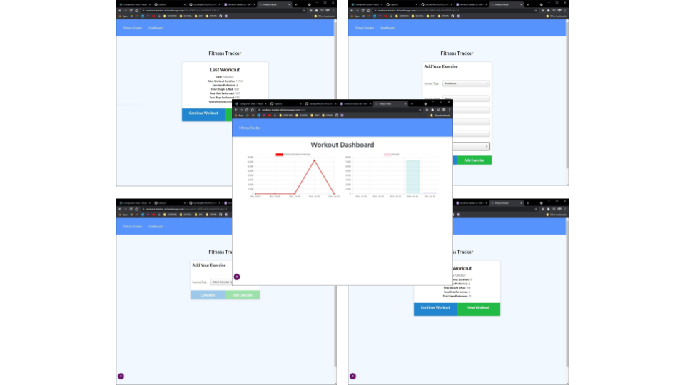

# 20210722 - Workout Tracker 


 ## Table of Contents.
 * [Overview](#overview)
 * [Design](#overview)
 * [Criteria](#given-criteria)
 * [Questions](#have-questions)
 * [Links](#links)
 ---


## Overview 
Tasked to updated provided code to be able to log multiple exercises in a workout on a given day. Should also be able to track the name, type, weight, sets, reps, and duration of exercise. If the exercise is a cardio exercise, I should be able to track my distance traveled.

## Design


Design and UI remained unchanged from provide code.


---
## Given Criteria
The user should be able to:

  * Add exercises to the most recent workout plan.

  * Add new exercises to a new workout plan.

  * View the combined weight of multiple exercises from the past seven workouts on the `stats` page.

  * View the total duration of each workout from the past seven workouts on the `stats` page.


---
## Have Questions
### You can contact me at:

    GITHUB: <https://github.com/ZacharyWK>

    EMAIL: <ZachKrause@live.com>


---
## Links
[REPOSITORY](https://github.com/ZacharyWK/20210722-workout-tracker-zk)
```
https://github.com/ZacharyWK/20210722-workout-tracker-zk
```

[DEPLOYED](https://workout-tracker-zk.herokuapp.com/)
```
https://workout-tracker-zk.herokuapp.com/
```

